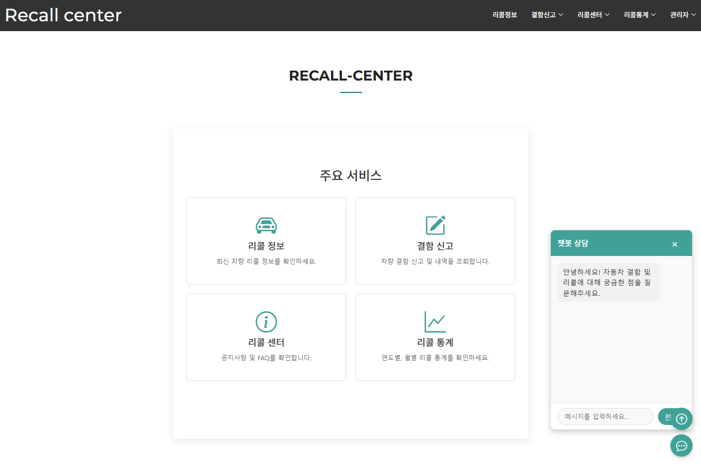

# Resume of [JooYeon](https://github.com/Wjyuy)
>
## 안녕하세요, Java 풀스택 개발자 우주연입니다.

스펀지처럼 지식을 흡수하며 성장하는 개발자가 되고 싶습니다.
항상 겸손한 자세로 새로운 것을 배우고자 노력합니다. 공부한 내용은 [블로그](https://dnwndus.tistory.com/)와 [노션](https://bottlenose-broker-f2a.notion.site/KH-2025-01-15-2025-07-10-17ca4c822156809eb3acdd4f06c81792?pvs=74)에 포스팅하고 있습니다.

### 1.1. Profile
이름: 우 주연

  - 생년월일: 2002-08-27
  - 연락처: 010-2374-0030
  - Github: [https://github.com/Wjyuy](https://github.com/Wjyuy)
  - Blog: [https://dnwndus.tistory.com](https://dnwndus.tistory.com/)
  - Email: zhzhwm@naver.com

### 1.2. Education
동아대학교 졸업 `2021-03 ~ 2025-02`

  - 주전공: 전자공학과
  - 학점: 3.72 / 4.50

### 1.3. Experiences

Company | Entry Date | Leave Date | Note
--------|------------|------------|-------
KH정보교육원 | 2025.01.15 | 2025.07.14 | 빅데이터 기반 엘라스틱 검색엔진 개발자 과정 부트캠프 6개월 과정 수료 [[노션기록]](https://bottlenose-broker-f2a.notion.site/KH-2025-01-15-2025-07-10-17ca4c822156809eb3acdd4f06c81792?pvs=74)

### 1.4. 보유 역량
4개의 개인, 협업 프로젝트 개발 경험 

Skill        | Note
-------------|-----------------------------------
Spring          | Spring framework, Mybatis or Query 기반으로 간단한 Backend API 서버 자체 개발 가능
Docker Registry      |  Image 관리 및 Docker, Docker-Compose를 통한 서버 배포 경험
TypeScript | Next.js 기반으로 확장 가능하고 사용자 친화적인 웹 애플리케이션 개발 가능
DB/SQL       | 효율적인 ERD 설계 및 SQL 쿼리 작성 능력

### 1.4.1 보유 기술

Division        | Skill
-------------|-----------------------------------
Back-End          | Java, MyBatis, Python, Tomcat
Front-End      | JavaScript, JSP & Servlet, jQuery, HTML5, CSS3, Ajax, React, TypeScript
Framework & Runtime | Spring (Boot, Legacy), Node.js, Next.js, Tailwind CSS
Database	 | Oracle, MySQL, PostgreSQL
Tools       | Eclipse, Visual studio Code, IntelliJ IDEA
Collaboration       | GitHub, Notion, Slack, Jira, Flow

## 2. Introduction
### 2.1. For a lifetime
저는 대학 시절 C언어를 처음 접하며 프로그래밍을 처음 접하게 되었습니다. 처음에는 낯선 문법과 복잡한 논리에 어려움을 겪기도 했지만 코드를 통해 제가 생각한 대로 프로그램이 동작하는 것을 보며 문제 해결의 짜릿함과 성취감을 느꼈습니다. 밤을 새 가며 cmd 텍스트 위주 도서 관리 프로그램을 코딩하였고, 작은 기능 하나 하나를 엮어내 프로그램을 구현해냈을 때의 기쁨은 저에게 개발이 단순한 학업을 넘어선 매력적인 활동임을 깨닫게 해주었습니다.

전자공학과를 졸업한 후에도, 학부생 시절 겪었던 프로그래밍 기술에 대한 갈증이 이어졌습니다. 따라서 저는 체계적인 교육을 통해 전문성을 기르기 위해 6개월간의 백엔드 부트캠프 과정을 수료하게 되었습니다. 이처럼 저는 개발에서 얻는 즐거움과 끊임없이 배우고 성장하는 과정에 깊이 매료되어 있으며, 앞으로도 개발자로서 끊임없이 배우고 기여하며 성장해나갈 것입니다.

### 2.2. 끊임없는 자기계발
신입 개발자로서 저는 꾸준함과 열정, 끈기를 가장 중요한 자기계발 동력으로 삼고 있습니다. 6개월간의 부트캠프 과정 중에도 Typescript같은 언어를 독학하였고, 수료 후에도 저는 매일매일 새로운 지식을 습득하고 이를 제 것으로 만들기 위해 노력하고 있습니다.
[깃허브](https://github.com/Wjyuy)는 저의 꾸준한 노력을 기록하는 공간입니다. 개인 학습 내용을 정리하고, 새로운 기능을 실험하며 커밋을 이어가고 있습니다. 잘 모르는 내용에 대해 작업한 후에는, 그 내용을 [Tistory DevLog](https://dnwndus.tistory.com/)에 정리 후 업로드 하고 있습니다. 

이처럼 저는 매일의 노력을 통해 어제보다 더 나은 개발자가 되기 위해 끊임없이 정진하고 있습니다.

### 2.3. Standardization
개발을 시작하고 처음 팀 프로젝트를 시작했을땐 그저 기능 구현에만 급급했습니다. 하지만 다양한 프로젝트를 경험하고 마이그레이션 하면서 잘 설계된 아키텍처와 구조화된 코드가 얼마나 중요한지를 깨닫게 되었습니다. 단순히 동작하는 코드를 넘어, 유지보수가 쉽고, 확장 가능하며, 협업에 용이한 코드를 작성하는 것이 중요하다는 것을 알게 되었습니다.

저는 백엔드 개발에 있어 데이터 모델링(ERD 설계)의 중요성을 깊이 이해하고 있습니다. 서비스의 요구사항을 정확히 파악하여 데이터 간의 관계를 효율적으로 설계하는 것이 견고한 백엔드 시스템의 초석이 된다고 생각합니다. 또한, Spring Framework와 JPA/Query 기반의 API 서버 개발 경험을 통해 모듈화된 코드를 작성하고, 컨트롤러, 서비스, 리포지토리 계층을 분리하여 각자의 역할을 명확히 하는 구조화된 프로그래밍을 실천하고 있습니다.

이러한 설계 원칙들은 저의 협업 프로젝트 경험에서도 빛을 발했으며, 앞으로도 효율적이고 견고한 백엔드 시스템을 구축하는 데 기여할 것입니다.

### 2.4. Documentation
저는 개발 프로젝트를 진행함에 있어 문서화를 매우 중요하게 여기며 이를 항상 실천합니다.

협업 프로젝트를 진행할 때 PM역할을 맡아 하였습니다. [Slack과 Jira](https://github.com/Wjyuy/Recall_Final?tab=readme-ov-file#%ED%98%91%EC%97%85%ED%88%B4-%EC%9E%90%EB%8F%99%ED%99%94-%ED%99%9C%EC%9A%A9)를 통해 이슈를 체계적으로 관리하고, 기능 개발이나 버그 수정 시에는 관련 이슈를 반드시 작성하고 커밋 메시지에 이를 참조 및 자동화를 진행하였습니다. 이는 프로젝트의 히스토리를 명확히 하고, 팀원 간의 소통을 원활하게 하는 데 큰 도움이 되었습니다. 또한, 사용한 API나 기능에 대해 간단한 가이드 문서를 Slack 탭에 작성하여 팀원들이 쉽게 이해하고 활용할 수 있도록 노력했습니다.

이처럼 저는 명확한 문서화를 통해 프로젝트의 투명성을 높이고, 효율적인 협업을 위한 기반을 다지는 개발자입니다.

## 3. Projects
### 3.1. 상품 구매 웹서비스 (ShoFriend)

이미지 클릭 시 깃허브 링크로 이동합니다.

shofriend 포스터

첫 팀 프로젝트로, '메신저와 쇼핑몰 기능을 합친 웹 사이트를 제작하면 좋겠다'는 아이디어에서 시작한 상품 구매 웹서비스 프로젝트입니다.

- 프로젝트 진행 기간 : `2025. 05. 07 ~ 2025. 05. 14`
  
- 내가 기여한 부분

  - Spring legacy기반 프로젝트를 Spring boot로 마이그레이션
  - 핵심 역할 : 팀장(PM), UUID 이미지 및 상품 CRUD, 장바구니 기능, 카카오페이 api 결제 기능 도입, 친구 CRUD및 추천 구매 알고리즘 고안 및 제작, bootstrap를 활용한 JSP FE 리팩토링, Spring boot로 마이그레이션

- 사용 기술 
  -JSP & Servlet 
  -Ajax 
  -JavaScript ES6+ 
  -Spring Boot 2.7.x 
  -Java 17 
  -MyBatis 2.3.x
  -MySQL
-트러블 슈팅
  -해당 경험을 통해 알게된 점

### 3.2. 빅데이터 프로젝트(RecallCenter)

이미지 클릭 시 깃허브 링크로 이동합니다.

shofriend 포스터

[Render활용한 배포](https://recall-final-front.onrender.com/)링크는 BE서버 불안정으로 접속이 불가할 수 있습니다.

RecallCenter는 공공데이터포탈의 자동차 결함 리콜현황 데이터를 활용한 빅데이터 프로젝트입니다. 

- 프로젝트 진행 기간 : `2025. 05. 19 ~ 2025. 05. 25`
- JSP 기반 프로젝트를 React를 사용한 SPA 로 리팩토링
- 핵심 역할 : 팀장(PM), React 기반 SPA로 FE 마이그레이션 및 컴포넌트/레이아웃화, Spring Boot 백엔드, REST API 연동, chart, pdf generater활용, Google gemini Api 활용한 챗봇기능, 분석기능 제작

| division  | skill                                                     |
|-----------|-----------------------------------------------------------|
| **Front-end** | **React(19.1.0)**, **Node.js(v22.14.0)**, **JavaScript**  |
| **Back-end** | **Spring Boot (2.7.13)**, **Java (17)**, **MyBatis (2.3.1)** |
| **DB** | **MySQL**                 |

### 3.2. 개인 프로젝트(Gemsup)

이미지 클릭 시 깃허브 링크로 이동합니다.

Gemsup은 docker 배포, Typescript 적용 학습을 위해 제작한 개인 프로젝트로, IGDB api를 활용한 게임리스트 서치 및 정보출력 웹사이트입니다. 

- 프로젝트 진행 기간 : `2025. 05. 27 ~ 2025. 05.30`
- IGDB API연동, DB 저장 및 캐싱
- 핵심 역할 : 목록 조회(무한 스크롤, 페이징, 정렬, 필터링), 상세 정보 조회, 검색/필터 UI, 카드형 목록

| division  | skill                                                     |
|-----------|-----------------------------------------------------------|
| **Front-end** | **React(19.1.0)**, **Node.js(16.x)**, **Typescript(4.9.5)** |
| **Back-end** | **Spring Boot (2.7.13)**, **Java (17)**, **MyBatis (2.3.1)** |
| **DB** | **PostgreSQL**                 |
| **Infra** | **Docker(3.8)**                 |

### 3.4. 빅데이터 검색 엔진 프로젝트(MoodSync)

이미지 클릭 시 깃허브 링크로 이동합니다.

MoodSync는 사용자의 감정을 파악하고 그에 맞는 음악, 책, 활동을 추천하는 웹사이트 프로젝트입니다.

- 프로젝트 진행 기간 : `2025. 05. 27 ~ 2025. 06. 16`
- JSP 기반 프로젝트를 React를 사용한 SPA 로 리팩토링
- 핵심 역할 : TypeScript구조파악 및 코드리뷰, 라우트 엔트리 포인트 컴포넌트/레이아웃화, hello-pangea적용한 로직 제작, Face-api 계산 hook 제작, Collection 페이지CRUD 및 리스트 재정렬 기능 제작, jwt와 security설정 REST API방식으로 마이그레이션

| division  | skill                                                     |
|-----------|-----------------------------------------------------------|
| **Front-end** | **React(18.2.0)**, **Next.js(15.2.x)**, **Typescript(5)**, **tailwindcss(3.4.x)** |
| **Back-end** | **Spring Boot (2.7.13)**, **Java (17)**, **MyBatis (2.3.1)** |
| **DB** | **Oracle**                 |

Project            | Skills           | Description
-------------------|------------------|-----------------------------
[ShoFriend](https://github.com/Wjyuy/Shofriend_boot) | spring boot | 팀 프로젝트(팀장), 전체 프로젝트 기여도 : 50% 
[RecallCenter](https://github.com/Wjyuy/Recall_Final) | spring boot & React | 팀 프로젝트(팀장), 전체 프로젝트 기여도 : 50% 
[GemSup](https://github.com/Wjyuy/docker_PJ) | spring boot & TypeScript | 개인 프로젝트
[MoodSync](https://github.com/Wjyuy/MoodSync) | spring boot & TypeScript | 팀 프로젝트, 전체 프로젝트 기여도 : 30% 

