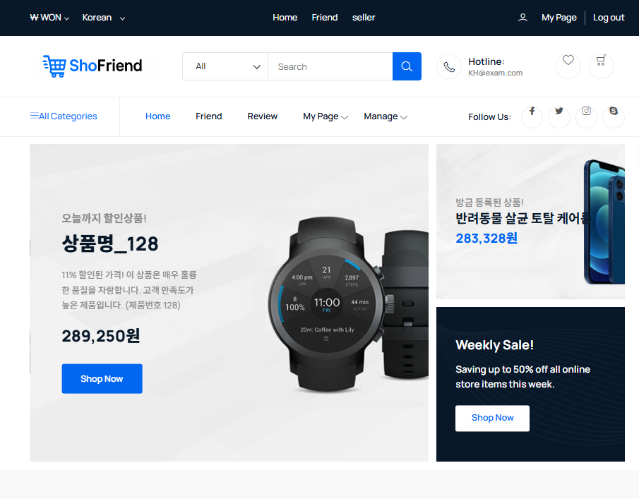

# Resume of [JooYeon](https://github.com/Wjyuy)

### 안녕하세요, Java 풀스택 개발자 우주연입니다.

스펀지처럼 지식을 흡수하며 성장하는 개발자가 되고 싶습니다.
항상 겸손한 자세로 새로운 것을 배우고자 노력합니다. 공부한 내용은 [블로그](https://dnwndus.tistory.com/)와 [노션](https://bottlenose-broker-f2a.notion.site/6bff4e6cee5a40f8855b14e279ff7e87)에 포스팅하고 있습니다.

### 협업의 중요성을 잘 알고 있습니다.
Slack과 Jira를 활용한 이슈관리를 통해 프로젝트의 히스토리를 투명하게 기록하고 공유하는 것이 팀원 간의 원활한 소통과 효율적인 문제 해결에 결정적인 역할을 한다는 것을 체감했습니다. 명확한 문서화와 팀원들끼리 같은 정보를 기반으로 협력할 수 있는 견고한 협업 환경을 구축하고 싶습니다.

### Profile
이름: 우 주연

  - 생년월일: 2002-08-27
  - 연락처: 010-2374-0030
  - Github: [https://github.com/Wjyuy](https://github.com/Wjyuy)
  - Blog: [https://dnwndus.tistory.com](https://dnwndus.tistory.com/)
  - Email: zhzhwm@naver.com
  - 동아대학교 전자공학과 졸업
    
### Experiences

Company | Entry Date | Leave Date | Note
--------|------------|------------|-------
KH정보교육원 | 2025.01.15 | 2025.07.14 | 빅데이터 기반 엘라스틱 검색엔진 개발자 과정 부트캠프 6개월 과정 수료 [[노션기록]](https://bottlenose-broker-f2a.notion.site/KH-2025-01-15-2025-07-10-17ca4c822156809eb3acdd4f06c81792?pvs=74)

## Skill
### Java 
- Spring Boot를 활용하여 RESTful API 서버 구축이 가능합니다.
- MyBatis를 이용하여 효율적인 SQL 쿼리 작성, DB 연동, 관리 작업을 할 수 있습니다.
- DI, AOP 등 Spring 핵심 원리를 이해하고 프로젝트에 적용할 수 있습니다.
  
### Oracle & MySQL 
- 쿼리 최적화 및 인덱싱을 통해 성능 개선 경험이 있습니다.
- JOIN 쿼리, View, Procedure등을 작성하여 데이터를 효율적으로 조회하고 조작할 수 있습니다.
  
### NextJS 
- API Routes를 활용하여 BFF 레이어를 구축하고 관리한 경험이 있습니다.
  - Axios interceptor를 활용하여 중앙집중식 API 요청 및 응답 처리 로직을 구현했습니다. 이를 통해 JWT인증 자동화 및 공통 에러 핸들링을 효과적으로 처리했습니다.
- CRUD및 특정 비즈니스 로직(순서 변경,복사 등)을 처리하는 다양한 API 연동 함수를 구현했습니다.
  
### TypeScript & JavaScript 
- 비동기 처리를 활용한 프로그래밍이 가능합니다.
- React / Next.js 환경에서 TypeScript를 적용하여 타입 안정성을 확보하며 개발한 경험이 있습니다.
- 클린 코드 및 재사용 가능한 컴포넌트 설계 원칙을 준수하여 개발할 수 있습니다.
  
### ETC 
- Docker
  - Image 관리 및 애플리케이션을 컨테이너화하고 배포 환경을 구축한 경험이 있습니다.
- Slack & Jira & Flow
  - 프로젝트 팀장으로서, PM역할을 맡아 자동화 환경을 구축한 경험이 있습니다.

## Projects
### 3.1. 상품 구매 웹서비스 (ShoFriend)

이미지 클릭 시 깃허브 링크로 이동합니다.

shofriend 포스터

첫 팀 프로젝트로, '메신저와 쇼핑몰 기능을 합친 웹 사이트를 제작하면 좋겠다'는 아이디어에서 시작한 상품 구매 웹서비스 프로젝트입니다.

- 프로젝트 진행 기간 : `2025. 05. 07 ~ 2025. 05. 14`
  
- 내가 기여한 부분

  - Spring legacy기반 프로젝트를 Spring boot로 마이그레이션
  - 핵심 역할 : 팀장(PM), UUID 이미지 및 상품 CRUD, 장바구니 기능, 카카오페이 api 결제 기능 도입, 친구 CRUD및 추천 구매 알고리즘 고안 및 제작, bootstrap를 활용한 JSP FE 리팩토링, Spring boot로 마이그레이션

- 사용 기술 
  -JSP & Servlet 
  -Ajax 
  -JavaScript ES6+ 
  -Spring Boot 2.7.x 
  -Java 17 
  -MyBatis 2.3.x
  -MySQL
-트러블 슈팅
  -해당 경험을 통해 알게된 점

### 3.2. 빅데이터 프로젝트(RecallCenter)

이미지 클릭 시 깃허브 링크로 이동합니다.

shofriend 포스터

[Render활용한 배포](https://recall-final-front.onrender.com/)링크는 BE서버 불안정으로 접속이 불가할 수 있습니다.

RecallCenter는 공공데이터포탈의 자동차 결함 리콜현황 데이터를 활용한 빅데이터 프로젝트입니다. 

- 프로젝트 진행 기간 : `2025. 05. 19 ~ 2025. 05. 25`
- JSP 기반 프로젝트를 React를 사용한 SPA 로 리팩토링
- 핵심 역할 : 팀장(PM), React 기반 SPA로 FE 마이그레이션 및 컴포넌트/레이아웃화, Spring Boot 백엔드, REST API 연동, chart, pdf generater활용, Google gemini Api 활용한 챗봇기능, 분석기능 제작

| division  | skill                                                     |
|-----------|-----------------------------------------------------------|
| **Front-end** | **React(19.1.0)**, **Node.js(v22.14.0)**, **JavaScript**  |
| **Back-end** | **Spring Boot (2.7.13)**, **Java (17)**, **MyBatis (2.3.1)** |
| **DB** | **MySQL**                 |

### 3.2. 개인 프로젝트(Gemsup)

이미지 클릭 시 깃허브 링크로 이동합니다.

Gemsup은 docker 배포, Typescript 적용 학습을 위해 제작한 개인 프로젝트로, IGDB api를 활용한 게임리스트 서치 및 정보출력 웹사이트입니다. 

- 프로젝트 진행 기간 : `2025. 05. 27 ~ 2025. 05.30`
- IGDB API연동, DB 저장 및 캐싱
- 핵심 역할 : 목록 조회(무한 스크롤, 페이징, 정렬, 필터링), 상세 정보 조회, 검색/필터 UI, 카드형 목록

| division  | skill                                                     |
|-----------|-----------------------------------------------------------|
| **Front-end** | **React(19.1.0)**, **Node.js(16.x)**, **Typescript(4.9.5)** |
| **Back-end** | **Spring Boot (2.7.13)**, **Java (17)**, **MyBatis (2.3.1)** |
| **DB** | **PostgreSQL**                 |
| **Infra** | **Docker(3.8)**                 |

### 3.4. 빅데이터 검색 엔진 프로젝트(MoodSync)

이미지 클릭 시 깃허브 링크로 이동합니다.

MoodSync는 사용자의 감정을 파악하고 그에 맞는 음악, 책, 활동을 추천하는 웹사이트 프로젝트입니다.

- 프로젝트 진행 기간 : `2025. 05. 27 ~ 2025. 06. 16`
- JSP 기반 프로젝트를 React를 사용한 SPA 로 리팩토링
- 핵심 역할 : TypeScript구조파악 및 코드리뷰, 라우트 엔트리 포인트 컴포넌트/레이아웃화, hello-pangea적용한 로직 제작, Face-api 계산 hook 제작, Collection 페이지CRUD 및 리스트 재정렬 기능 제작, jwt와 security설정 REST API방식으로 마이그레이션

| division  | skill                                                     |
|-----------|-----------------------------------------------------------|
| **Front-end** | **React(18.2.0)**, **Next.js(15.2.x)**, **Typescript(5)**, **tailwindcss(3.4.x)** |
| **Back-end** | **Spring Boot (2.7.13)**, **Java (17)**, **MyBatis (2.3.1)** |
| **DB** | **Oracle**                 |

Project            | Skills           | Description
-------------------|------------------|-----------------------------
[ShoFriend](https://github.com/Wjyuy/Shofriend_boot) | spring boot | 팀 프로젝트(팀장), 전체 프로젝트 기여도 : 50% 
[RecallCenter](https://github.com/Wjyuy/Recall_Final) | spring boot & React | 팀 프로젝트(팀장), 전체 프로젝트 기여도 : 50% 
[GemSup](https://github.com/Wjyuy/docker_PJ) | spring boot & TypeScript | 개인 프로젝트
[MoodSync](https://github.com/Wjyuy/MoodSync) | spring boot & TypeScript | 팀 프로젝트, 전체 프로젝트 기여도 : 30% 

